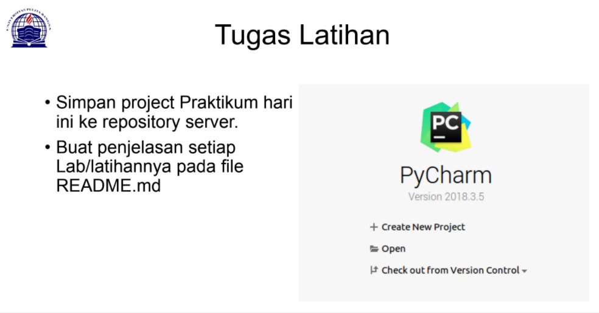
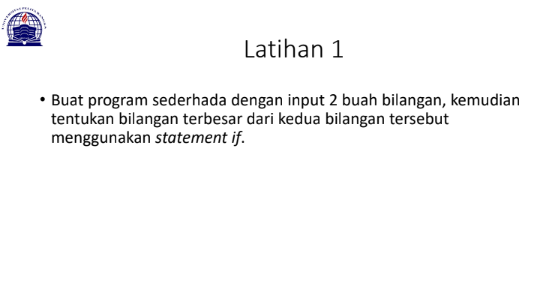
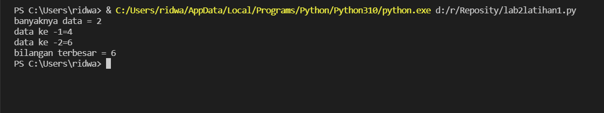
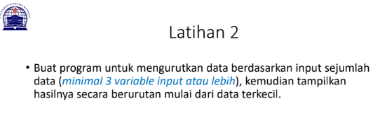
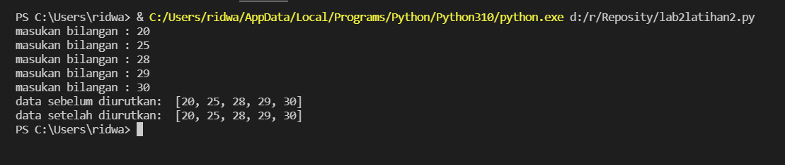
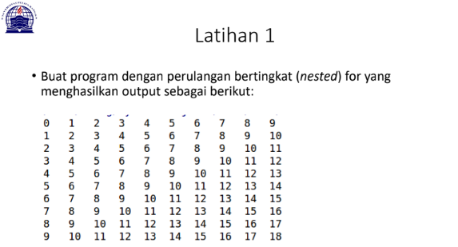
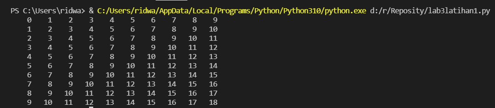
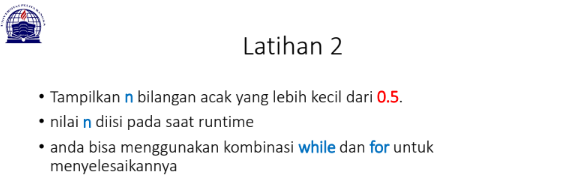
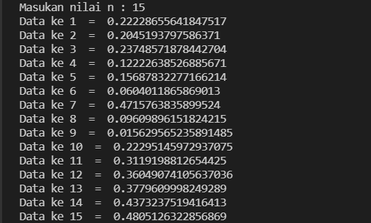

# Pertemuan 7

# Lab 2 Latihan 1

## Soal

Pada lab 2 latihan 1 saya diberi soal sebagai berikut :

Untuk mengerjakan saya memasukkan syntax di bawah : 

    N=int(input("banyaknya data = "))
    if N>0:
        i=1
        x=int(input("data ke -"+str(i)+"="))
        max=x;total=x
        for i in range(2,N+1):
            x=int (input("data ke -"+str(i)+"="))
            total+=x
            if max<x:
                max=x

        print("bilangan terbesar =",max)

Dari proses di atas saya mendapatkan output :

# Lab 2 latihan 2

## Soal

Pada lab 2 latihan 2 saya diberi soal sebagai berikut :

Untuk mengerjakan saya memasukkan syntax di bawah :

    data = []
    for i in range (5):
        x =int(input("masukan bilangan : "))
        data.append(x)
    print('data sebelum diurutkan: ',data)
    list.sort(data)
    print('data setelah diurutkan: ',data)

Dari proses saya mendapatkan output :

# Lab 3 Latihan 1

## Soal

Pada lab 3 latihan 1 saya diberi soal :

Untuk mengerjakan saya memasukkan syntax dibawah :

    baris = 10
    kolom = baris

    for bar in range(baris):
        for col in range(kolom):
            tab = bar+col
            print("{0:>5}".format(tab), end='')
        print()

dari proses diatas saya mendapatkan output

# Lab 3 Latihan 2

## Soal 

Pada lab 3 latihan 2 saya diberi soal :

Untuk mengerjakan soal diatas saya menggunakan syntax dibawah :

    import random
    print(40*"=")
    print("Bilangan acak yang lebih kecil dari 0,5")
    print(40*"=")
    jum = int( input("Masukan nilai n : "))
    i = 0
    for i in range(jum):
        i += 1
        angkaDec = random.uniform(0, 0.5)
        print("Data ke", i, " = ", angkaDec)
Dari proses di atas saya mendapatkan output dibawah :

Terima kasih

